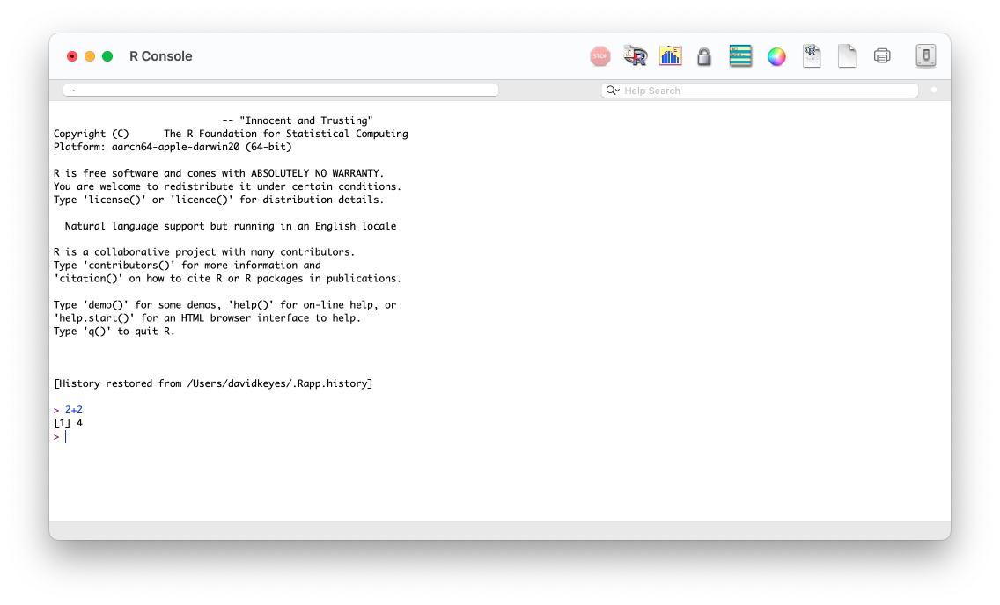
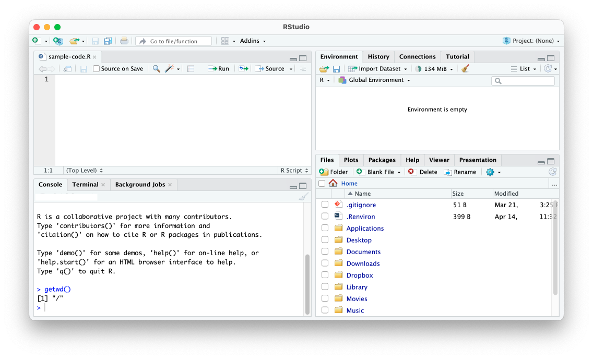
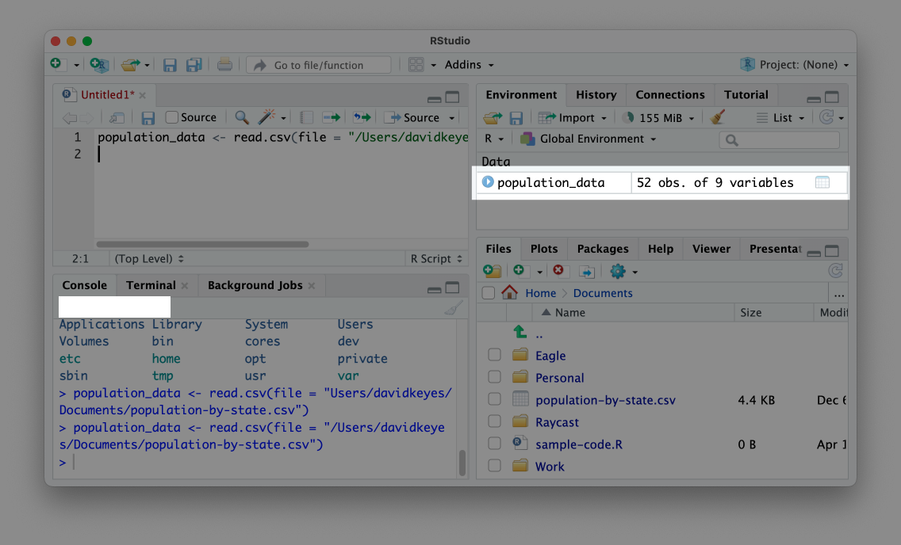
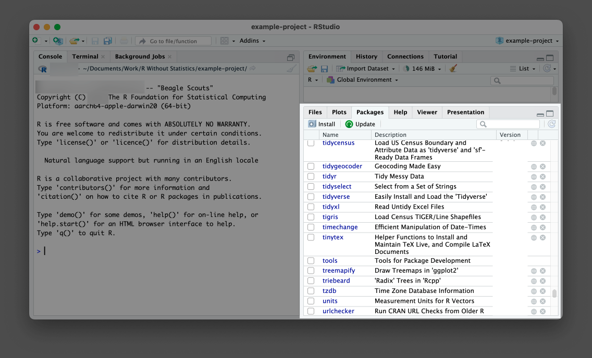
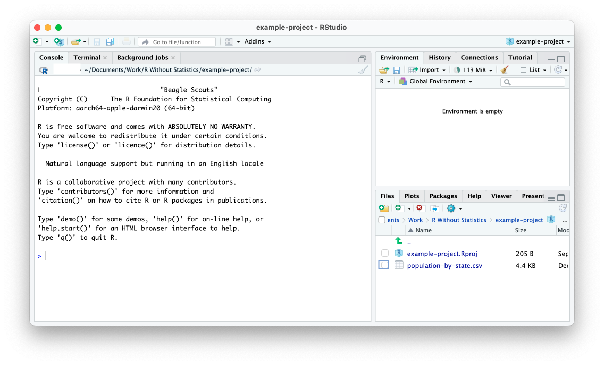
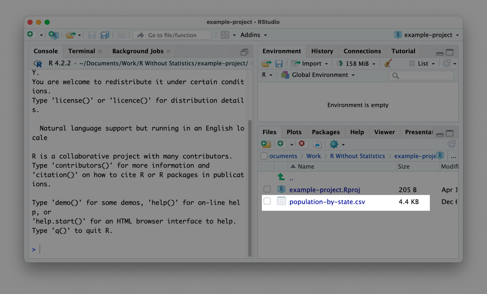

# An R Programming Crash Course {#howto-chapter}

R has a well-earned reputation for being hard to learn. Especially for those who come to R without programming experience, it can be hard to figure out how things work. This chapter is designed to help those who have never used R before. I'll start from scratch, showing you what you need to download in order to use R, and how to work with data using functions, objects, packages, and projects. If you have some experience with R, feel free to skip this chapter. But if you're just starting out, this chapter will help you understand the basics, and help you make sense of the rest of the book.

## Getting Set Up {-}

One of the more confusing things for people just starting out is that you need two pieces of software in order to use R. The first is R itself, which provides the underlying computational tools that make R work. The second is RStudio, which makes working with R much easier. The best way to understand the relationship between R and RStudio is with this analogy from the book *Modern Dive*  by Chester Ismay and Albert Kim. R is the engine that makes your work with data go. RStudio is like a dashboard that makes it easier to work with your data by providing a more user-friendly interface. 

Let's download each piece and get started. To download R, go to https://cloud.r-project.org/ and choose your operating system, as seen in Figure \@ref(fig:cran-download-r)

[F02001.png]

{width=100%}


Once you download and install R, open it and you can work at the command line. For example, I can type 2 + 2, hit enter, and I will see 4, as seen in Figure \@ref(fig:r-console).

[F02002.png]

{width=100%}


Simple math problems are only the start; you can do pretty much anything in R. No matter what you're planning to do, you're probably not super impressed with the R interface. A few brave souls work only using the command line we're looking at, but most do not. RStudio is where most R coders do their work. RStudio is like a skin that lives on top of R itself. It doesn't provide new functionality to R, but it wraps R in a much more user-friendly interface, providing a way to see your files, outputs, and more. You can download RStudio at https://posit.co/download/rstudio-desktop/. Install RStudio as you would any other app and open it up. RStudio has several panels. The first time you open RStudio, you'll see these the three panels shown in Figure \@ref(fig:rstudio-no-project) below.

[F02003.png]

{width=100%}


The left side panel should look familiar. It is what we saw when working in R. This is known as the **console**. You'll use it to add code and see results. This panel, like the others we'll discuss, has several tabs (terminal and background jobs) for more advanced usages. For now, we'll stick to the default tab. Let's look at the bottom right panel next. This **files** panel shows all of the files on my computer. Finally, the top right panel shows my **environment**. The environment shows the objects (discussed below) I have available to me when working in RStudio. There's one more panel that you'll typically have when working in RStudio. But to make it appear, we need to create an R script file. 

## R Script Files {-}

If you work in the console, either in RStudio or in R itself, you don't have a record of your code. Say you sit down today and write code to import your data, analyze it, and make some graphs. You don't want to have to recreate that code from scratch tomorrow. The way to save your code is by using files. Files allow you to save all of the code you have written. There are two types of files we'll discuss in this book:

1. R script files, which only contain code.
2. R Markdown files, which contain code combined with text. 

We'll talk about R Markdown files starting in Chapter \@ref(rmarkdown-chapter). Let's start with R script files, which use the .R extension. To create an R script file, go to File > New File > R Script. When you create a new R script file, you'll now have a fourth panel in the top left, which you can see in Figure \@ref(fig:rstudio-four-panels). I'll save this file in my `Documents` folder as `sample-code.R`. 

[F02004.png]

{width=100%}


I can now use the same syntax in my R script file that I did when working in just R. If I type `2 + 2` in the R script file and hit the **Run** button, 4 will show up in the console pane. If you're looking to learn R, it's probably not to help you figure out the answer to 2 + 2. Instead, you probably want to read in your own data and do analysis on it. Let's work with some real data. 

## Working with Data {-}

To explain how you work with data in R, we need go on a bit of a detour. We'll make stops to discuss RStudio functions, objects, packages, and projects before we import and take a look at our data.

Conceptually, working with data in R is very different than working with data in a tool like Excel. In Excel, your data and any analysis you do on it all live in the same place: a spreadsheet. With R, you typically have data that lives in some external source (for example, an Excel spreadsheet or a CSV file). In order to work with this data in R, you have to run code to import it. It's only once you've run this code, which is made up of functions, that you have the data available in R. 

## Functions {-}

Let's say I have a CSV file called `population-by-state.csv` in my `Documents` folder that I want to import to R. To import it into R, you might think to add a line like this in the `sample-code.R` file:


```r
read.csv(file = "/Users/davidkeyes/Documents/population-by-state.csv")
```

This line shows the `read.csv()` function. Functions in R are pieces of code that you can run to do specific things. Functions have a name and arguments, which are surrounded by parentheses. Looking at the `read.csv()` function, the name, which appears before the open parentheses, is `read.csv`. Within the parentheses, we have the text `file = "Documents/population-by-state.csv"`. Here we can see the argument `file`. The text after the equals sign gives the location of the file we want to read in. Arguments work in this way: the argument name, followed by the equals sign, followed by some value. This allows us to do something general (like importing a CSV) while allowing us to choose the specific file to run the function on. Functions can have multiple arguments as well, each of which is separated by a comma. For example, this would read in the same file, but skip the first row.


```r
read.csv(file = "/Users/davidkeyes/Documents/population-by-state.csv",
				 skip = 1)
```

At this point, you might think to run the code in order to import your data. You can do so by selecting the line of code and hitting the Run button (or using the keyboard shortcut Command/Control + Enter on Mac/Windows). Running this code causes this text show up in the console pane. 


```
#>    rank                State      Pop  Growth  Pop2018
#> 1     1           California 39613493  0.0038 39461588
#> 2     2                Texas 29730311  0.0385 28628666
#> 3     3              Florida 21944577  0.0330 21244317
#> 4     4             New York 19299981 -0.0118 19530351
#> 5     5         Pennsylvania 12804123  0.0003 12800922
#> 6     6             Illinois 12569321 -0.0121 12723071
#> 7     7                 Ohio 11714618  0.0033 11676341
#> 8     8              Georgia 10830007  0.0303 10511131
#> 9     9       North Carolina 10701022  0.0308 10381615
#> 10   10             Michigan  9992427  0.0008  9984072
#> 11   11           New Jersey  8874520 -0.0013  8886025
#> 12   12             Virginia  8603985  0.0121  8501286
#> 13   13           Washington  7796941  0.0363  7523869
#> 14   14              Arizona  7520103  0.0506  7158024
#> 15   15            Tennessee  6944260  0.0255  6771631
#> 16   16        Massachusetts  6912239  0.0043  6882635
#> 17   17              Indiana  6805663  0.0165  6695497
#> 18   18             Missouri  6169038  0.0077  6121623
#> 19   19             Maryland  6065436  0.0049  6035802
#> 20   20             Colorado  5893634  0.0356  5691287
#> 21   21            Wisconsin  5852490  0.0078  5807406
#> 22   22            Minnesota  5706398  0.0179  5606249
#> 23   23       South Carolina  5277830  0.0381  5084156
#> 24   24              Alabama  4934193  0.0095  4887681
#> 25   25            Louisiana  4627002 -0.0070  4659690
#> 26   26             Kentucky  4480713  0.0044  4461153
#> 27   27               Oregon  4289439  0.0257  4181886
#> 28   28             Oklahoma  3990443  0.0127  3940235
#> 29   29          Connecticut  3552821 -0.0052  3571520
#> 30   30                 Utah  3310774  0.0499  3153550
#> 31   31          Puerto Rico  3194374  0.0003  3193354
#> 32   32               Nevada  3185786  0.0523  3027341
#> 33   33                 Iowa  3167974  0.0061  3148618
#> 34   34             Arkansas  3033946  0.0080  3009733
#> 35   35          Mississippi  2966407 -0.0049  2981020
#> 36   36               Kansas  2917224  0.0020  2911359
#> 37   37           New Mexico  2105005  0.0059  2092741
#> 38   38             Nebraska  1951996  0.0137  1925614
#> 39   39                Idaho  1860123  0.0626  1750536
#> 40   40        West Virginia  1767859 -0.0202  1804291
#> 41   41               Hawaii  1406430 -0.0100  1420593
#> 42   42        New Hampshire  1372203  0.0138  1353465
#> 43   43                Maine  1354522  0.0115  1339057
#> 44   44              Montana  1085004  0.0229  1060665
#> 45   45         Rhode Island  1061509  0.0030  1058287
#> 46   46             Delaware   990334  0.0257   965479
#> 47   47         South Dakota   896581  0.0204   878698
#> 48   48         North Dakota   770026  0.0158   758080
#> 49   49               Alaska   724357 -0.0147   735139
#> 50   50 District of Columbia   714153  0.0180   701547
#> 51   51              Vermont   623251 -0.0018   624358
#> 52   52              Wyoming   581075  0.0060   577601
#>     Pop2010 growthSince2010 Percent    density
#> 1  37319502          0.0615  0.1184   254.2929
#> 2  25241971          0.1778  0.0889   113.8081
#> 3  18845537          0.1644  0.0656   409.2229
#> 4  19399878         -0.0051  0.0577   409.5400
#> 5  12711160          0.0073  0.0383   286.1704
#> 6  12840503         -0.0211  0.0376   226.3967
#> 7  11539336          0.0152  0.0350   286.6944
#> 8   9711881          0.1151  0.0324   188.3054
#> 9   9574323          0.1177  0.0320   220.1041
#> 10  9877510          0.0116  0.0299   176.7351
#> 11  8799446          0.0085  0.0265  1206.7609
#> 12  8023699          0.0723  0.0257   217.8776
#> 13  6742830          0.1563  0.0233   117.3249
#> 14  6407172          0.1737  0.0225    66.2016
#> 15  6355311          0.0927  0.0208   168.4069
#> 16  6566307          0.0527  0.0207   886.1845
#> 17  6490432          0.0486  0.0203   189.9644
#> 18  5995974          0.0289  0.0184    89.7419
#> 19  5788645          0.0478  0.0181   624.8518
#> 20  5047349          0.1677  0.0176    56.8653
#> 21  5690475          0.0285  0.0175   108.0633
#> 22  5310828          0.0745  0.0171    71.6641
#> 23  4635649          0.1385  0.0158   175.5707
#> 24  4785437          0.0311  0.0147    97.4271
#> 25  4544532          0.0181  0.0138   107.0966
#> 26  4348181          0.0305  0.0134   113.4760
#> 27  3837491          0.1178  0.0128    44.6872
#> 28  3759944          0.0613  0.0119    58.1740
#> 29  3579114         -0.0073  0.0106   733.7507
#> 30  2775332          0.1929  0.0099    40.2918
#> 31  3721525         -0.1416  0.0095   923.4964
#> 32  2702405          0.1789  0.0095    29.0195
#> 33  3050745          0.0384  0.0095    56.7158
#> 34  2921964          0.0383  0.0091    58.3059
#> 35  2970548         -0.0014  0.0089    63.2186
#> 36  2858190          0.0207  0.0087    35.6808
#> 37  2064552          0.0196  0.0063    17.3540
#> 38  1829542          0.0669  0.0058    25.4087
#> 39  1570746          0.1842  0.0056    22.5079
#> 40  1854239         -0.0466  0.0053    73.5443
#> 41  1363963          0.0311  0.0042   218.9678
#> 42  1316762          0.0421  0.0041   153.2674
#> 43  1327629          0.0203  0.0040    43.9167
#> 44   990697          0.0952  0.0032     7.4547
#> 45  1053959          0.0072  0.0032  1026.6044
#> 46   899593          0.1009  0.0030   508.1242
#> 47   816166          0.0985  0.0027    11.8265
#> 48   674715          0.1413  0.0023    11.1596
#> 49   713910          0.0146  0.0022     1.2694
#> 50   605226          0.1800  0.0021 11707.4262
#> 51   625879         -0.0042  0.0019    67.6197
#> 52   564487          0.0294  0.0017     5.9847
```

This is R confirming that it read in the CSV file and showing us the data within it. You might think you are ready to work with your data in R. But in fact all you've done at this point is **display** the result of running the code that imports your data. To use the data again, you need to **save** the result of running the code to an object.

## Objects {-}

To save your data for reuse, you need to create an object. To do so, you would add to your data importing syntax from above. 


```r
population_data <- read.csv(file = "/Users/davidkeyes/Documents/population-by-state.csv")
```

The second half of this code is what we used above, but we've added to it. In the middle you will see this: `<-`. Known as the assignment operator, it takes what follows it and assigns it to the item on the left. To the left of the assignment operator is `population_data`. This is an **object**. Put together, the whole line reads in the CSV and assigns it to an object called `population_data`. If you run this line of code, you will now see `population_data` in your environment pane, as in Figure \@ref(fig:population-data-environment).

[F02005.png]

{width=100%}


This is confirmation that your data import worked and you have the `population_data` object ready for future use. Now, instead of having to rerun the code to import the data, I can simply type `population_data`, run that line, and I'll see the same output as above. Data imported to an object is known as a **data frame**.

## Packages {-}

The `read.csv()` function that we've used up to this point is one of a set of functions that come from what is known as base R. They are built into R and you simply have to type the name of the function to use it. However, one of the benefits of R being an open source language is that anyone create their own code and share it with others. R users around the world make what are called **packages**, which provide code to do specific things. 

The best analogy for understanding packages also comes from the *Modern Dive*  book. The functionality in base R is like that built into a phone. A phone can do a lot on its own. But you usually want to install apps on your phone to do specific things. Packages are like apps, giving you specific functionality that doesn't come built into base R.

You can install packages using the `install.packages()` function. For example, to install the `tidyverse` package, which provides a range of functions for data import, cleaning, analysis, visualization, and more, you would type `install.packages("tidyverse")`. I typically enter this code in the console because you only need to install a package once on your computer and so I know I won't need to rerun this code. 

To confirm that the `tidyverse` package has been installed correctly, click on the packages tab on the bottom right panel. Search for `tidyverse` and you should see it pop up, as in Figure \@ref(fig:tidyverse-installed).

[F02006.png]

{width=100%}


Now that we've installed the `tidyverse` package, let's use it. While you only need to install packages once per computer, you need to load packages each time you restart RStudio. You can only use functions from the `tidyverse` package if you first run the line `library(tidyverse)`. I'll go back to my `sample-code.R` file and re-import my data using a function from the `tidyverse` package. 


```r
library(tidyverse)

population_data_2 <- read_csv(file = "/Users/davidkeyes/Documents/population-by-state.csv")
```

At the top of my script I load the `tidyverse`. Then, I use the `read_csv()` function (note the `_` in place of the `.`) to import my data. This alternate function to import CSV files achieves the same goal of creating an object called `population_data_2`. If we type `population_data_2` and run the code (either by using the run button or the keyboard shortcut) you will see the output in the console. 


```
#> # A tibble: 52 × 9
#>     rank State               Pop  Growth  Pop2018  Pop2010
#>    <dbl> <chr>             <dbl>   <dbl>    <dbl>    <dbl>
#>  1     1 California     39613493  0.0038 39461588 37319502
#>  2     2 Texas          29730311  0.0385 28628666 25241971
#>  3     3 Florida        21944577  0.033  21244317 18845537
#>  4     4 New York       19299981 -0.0118 19530351 19399878
#>  5     5 Pennsylvania   12804123  0.0003 12800922 12711160
#>  6     6 Illinois       12569321 -0.0121 12723071 12840503
#>  7     7 Ohio           11714618  0.0033 11676341 11539336
#>  8     8 Georgia        10830007  0.0303 10511131  9711881
#>  9     9 North Carolina 10701022  0.0308 10381615  9574323
#> 10    10 Michigan        9992427  0.0008  9984072  9877510
#> # ℹ 42 more rows
#> # ℹ 3 more variables: growthSince2010 <dbl>, Percent <dbl>,
#> #   density <dbl>
```

What we see is slightly different from what we saw above using the `read.csv()` function. R describes the output as a **tibble** and only shows us the first 10 rows. This slightly different output occurs because `read_csv()` imports the data not as a data frame, but as a tibble. Both are used to describe rectangular data like what you would see in a spreadsheet. While there are some small differences between data frames and tibbles, I'll use the terms interchangeably in this book. 

## RStudio Projects {-}

So far, we've imported a CSV file from the Documents folder. But the path to the file on my computer was `/Users/davidkeyes/Documents/population-by-state.csv`. Since others will not have this exact location on their computer, if they try to run my code, it won't work. There's a solution to this problem, and it's called **RStudio projects**. 

By working in a project, you can use what are known as **relative paths** to your files. Instead of having to write out `read_csv(file = "/Users/davidkeyes/Documents/population-by-state.csv")`, you can put the CSV file in your project and then call it using `read_csv(file = "population-by-state.csv")`. This makes it easier for you, and enables others to use your code.

To create a new RStudio project, go to File > New Project. Select either New Directory or Existing Directory and choose where to put your project. If you choose New Directory, you'll need to specify that you want to create a new project. I'll do this and then choose a name for the new directory and where it should live. As seen in Figure \@ref(fig:create-new-project), you can leave the two checkboxes that ask about creating a git repository and using `renv` unchecked (these are for more advanced purposes). 

[F02007.png]

{width=100%}


Having now created this project, there are two major differences in RStudio's appearance:

First, the files pane no longer shows every file on my computer, but instead only shows files in the `example-project` directory. Right now that's just the `example-project.Rproj` file that indicates the folder contains a project. Second, at the very top right of RStudio, you can see the name of the `example-project` project (it had previously said `Project: (None)`). If you want to make sure you're working in a project, make sure you see its name here. Both of these changes can be seen in Figure \@ref(fig:rstudio-active-project) below.

[F02008.png]

{width=100%}


Now that I've created a project, I'll use the Finder on my Mac computer to copy the `population-by-state.csv` file into the `example-project` directory. Once I do this, I can see it in the RStudio files pane, as in Figure \@ref(fig:rstudio-project-csv).

[F02009.png]

{width=100%}


With this CSV file in my project, I can now import it more easily. As before, I'll start by loading the `tidyverse` package. After that, I can remove the reference to the `Documents` folder and import my data by simply using the name of the file:


```r
library(tidyverse)

population_data_2 <- read_csv(file = "population-by-state.csv")
```

I'm able to import the `population-by-state.csv` file in this way because the RStudio project sets the **working directory** to be the root of my project. With the working directory set in this way, all references to files are relative to the `.Rproj` file at the root of the project (this is where the name relative paths comes from). Now that we're working in a project, anyone can run this code because it imports the data from a location that they are guaranteed to have on their computer. 

## Data Analysis with R {-}

Now that we've imported data, let's do a bit of analysis on it. Below is a code snippet that calculates the mean population of all states using the `summarize()` function. 


```r
summarize(.data = population_data_2,
          mean_population = mean(Pop))
```

You can see that I'm using `population_data_2` with the `.data` argument, telling the `summarize()` function (which comes from the `tidyverse`) to use that data frame. The second half of the code creates a new variable called `mean_population`, which is calculated by using the `mean()` function on the `Pop` variable. Running this code will return a tibble with a single variable (`mean_population`) that is of type double (meaning numeric) and has a value of 6433422, the mean population of all states. 


```
#> # A tibble: 1 × 1
#>   mean_population
#>             <dbl>
#> 1        6433422.
```

This is a basic example of data analysis, but you can do a lot more with the `tidyverse`. One advantage of working with the `tidyverse` is that it uses what's known as the **pipe** for multi-step operations. The `tidyverse` pipe, which is written with the text `%>%`, allows us to break steps into multiple lines (the functionally equivalent so-called native pipe uses the text `|>`). For example, I can rewrite the code above to do the same thing using the pipe. 


```r
population_data_2 %>% 
  summarize(mean_population = mean(Pop))
```

This code says: start with the `population_data_2` data frame, then run the `summarize()` function on it, creating a variable called `mean_population` by calculating the mean of the `Pop` variable. 

The pipe becomes even more useful when we use multiple steps. Let's say, for example, we want to calculate the mean population of the five largest states. The code below adds a line that uses the `filter()` function (also from the `tidyverse`) to only include states where the `rank` variable (which is the rank of the total population size of all states) is less than or equal to five (in other words, rank one through five). Then, it uses `summarize()` function as we did before.


```r
population_data_2 %>% 
  filter(rank <= 5) %>% 
  summarize(mean_population = mean(Pop))
```
Running this code shows us the mean population of the five largest states. 


```
#> # A tibble: 1 × 1
#>   mean_population
#>             <dbl>
#> 1        24678497
```
Combining functions using the pipe lets us do multiple things on our data in a way that keeps our code readable and easy to understand. We've introduced only two functions for analysis at this point, but the `tidyverse` has many functions that enable you to do nearly anything you could hope to do with your data. In fact, while I've been referring to the `tidyverse` as a single package, it is actually a collection of packages that do data importing, analysis, visualization, and more. The book *R for Data Science* by Hadley Wickham, Mine Çetinkaya-Rundel, and Garrett Grolemund is the bible of `tidyverse` programming and worth reading for more details on how its many packages work. In this book, I'll introduce you to a number of packages, but because of how useful it is, the `tidyverse` will appear in every single piece of R code I write. 

## How to Get Help {-}

Now that you've learned about the basics of how R works, you're probably ready to dive in. When you do, you're going to encounter errors. Everyone does, and it's just part of working in R. Learning how to get help when you do run into issues is a key part of learning to use R successfully. There are two main strategies you can use to get unstuck.

The first is to read the documentation for functions. To access the documentation for any function, simply type the `?` and then the name of the function. For example, if I run the line `?read.csv`, I will see the documentation pop up in the bottom right panel, as in Figure \@ref(fig:readcsv-documentation).

[F02010.png]

{width=100%}


Help files can be a bit hard to decipher but at their core, they tell you what package the function comes from, what it does, its arguments, and some examples of how to use it. For additional guidance on reading documentation, I recommend the appendix of Kieran Healy's book *Data Visualization: A practical introduction* (a free online version is available at https://socviz.co/appendix.html).

In addition to providing help files in RStudio, many R packages have documentation websites. I find these easier to read and tend to use them when I am confused about how to use a function. In addition, many packages have longer articles known as vignettes that provide an overview of how the package works. Reading these can help you see how individual functions can be used in the context of a larger project. Every package I discuss in this book has a good documentation website. 

## In Conclusion: Invest Time Now to Learn R and Save Time Later {-}

Getting started with R can be challenging. I myself experienced many frustrations early on that I've since realized are quite common. This chapter has, hopefully, helped you to see how you can get started with R. Understanding how functions, objects, packages, and projects work is key to ensuring that you can successfully use R to work with your data. 

If R feels challenging, just know that it will get better with time. Best of all, the time you invest in learning to use R will repay itself many times over. My favorite example to show this is one I discuss in Chapter \@ref(parameterized-reports-chapter), which discusses a technique called parameterized reporting to automatically produce dozens, hundreds, or even thousands of reports at once. At my company, R for the Rest of Us, we worked with a client to produce reports on demographics and housing data for each of the 170 plus towns and counties in the state of Connecticut. Doing this by hand would have taken the client hundreds of hours. Using R, we were able to automate the process so they can generate the reports simply by running code. If you make multiple reports by hand, think of the hours you're spending. Reframe the time it takes to learn R as an investment in never having to do this manual labor again. When you're struggling to make sense of an inscrutable error message, you will get frustrated. But, with all of the time you'll save, I promise that it is worth the effort to learn R.

